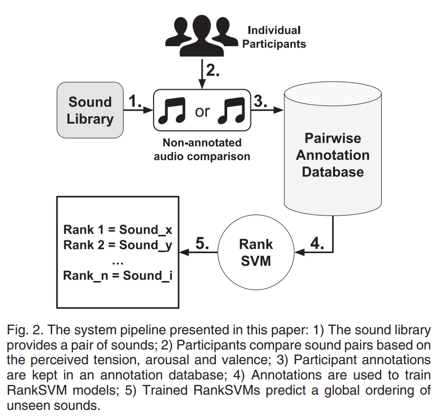
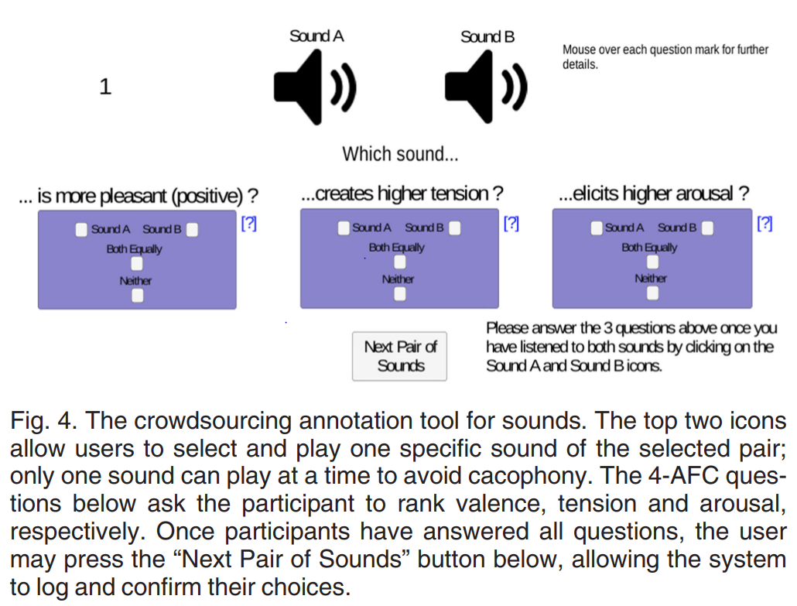
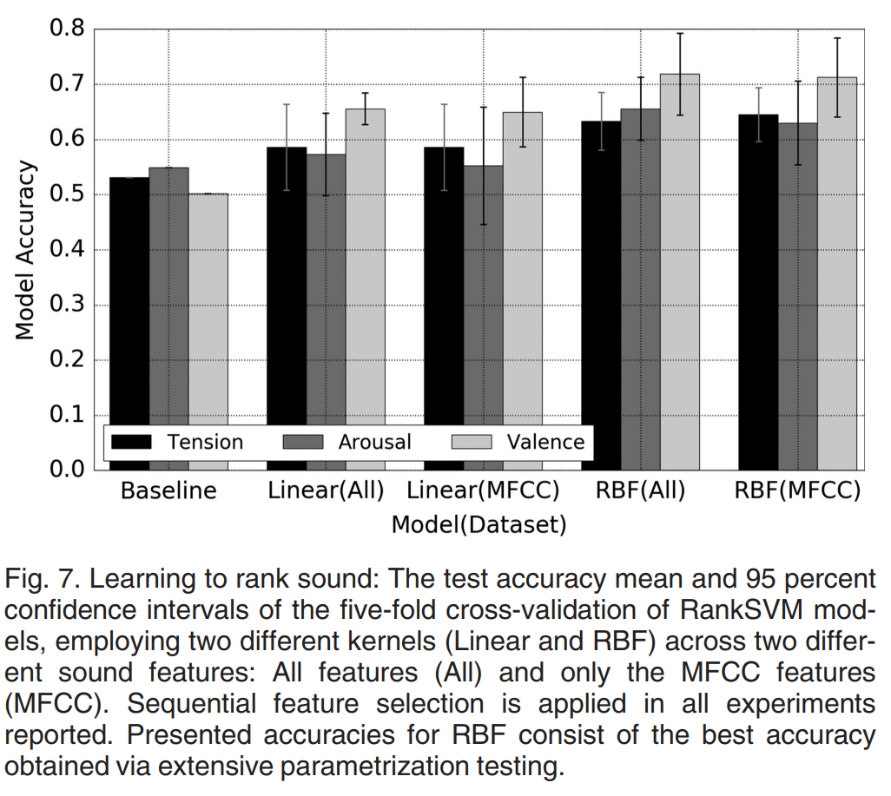
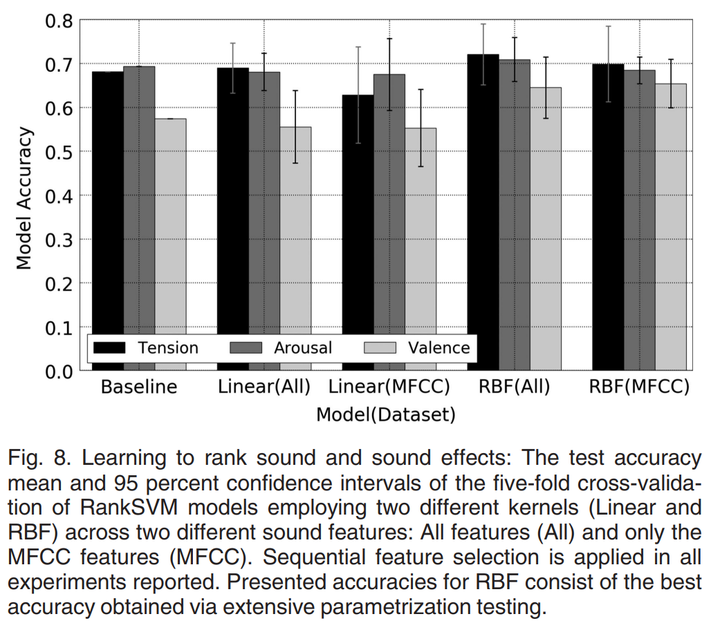

# Modelling Affect for Horror Soundscapes

【Authors】Phil Lopes; Antonios Liapis; Georgios N. Yannakakis  
【Publisher】IEEE Transactions on Affective Computing (Volume: 10, Issue: 2, April-June 1 2019)  
【Submission】2019  
【URL】[https://ieeexplore.ieee.org/document/7439777](https://ieeexplore.ieee.org/document/7903629)  

【Abstract】  
The feeling of horror within movies or games relies on the audience's perception of a tense atmosphere-often achieved through sound accompanied by the on-screen drama-guiding its emotional experience throughout the scene or game-play sequence. These progressions are often crafted through an a priori knowledge of how a scene or game-play sequence will playout, and the intended emotional patterns a game director wants to transmit. The appropriate design of sound becomes even more challenging once the scenery and the general context is autonomously generated by an algorithm. Towards realizing sound-based affective interaction in games this paper explores the creation of computational models capable of ranking short audio pieces based on crowdsourced annotations of tension, arousal and valence. Affect models are trained via preference learning on over a thousand annotations with the use of support vector machines, whose inputs are low-level features extracted from the audio assets of a comprehensive sound library. The models constructed in this work are able to predict the tension, arousal and valence elicited by sound, respectively, with an accuracy of approximately 65%, 66% and 72%.

## １．研究概要  
ゲーム用BGMを"tension"，"arousal"，"valence"に基づいてランキングする機械学習モデルを提案した．提案モデルは，クラウドソーシングによってアノテーションされたペアデータに対して，プリファレンス学習で訓練される．
## ２．問題設定と解決した点  
音楽の感情認識に関する研究はこれまでも行われてきたが，本研究は，映画やゲームでプレイヤーの主観感情に影響を与えるためのBGMをはじめて扱った．また，サウンドエフェクトが追加されたBGMと感情状態のマッピングを導出するはじめての研究である．
## ３．技術や手法のキモ  
  
  
BGMのペアデータセットを構築する．次に，ペアのうちどちらがより好ましいかを選ぶペアワイズランキング形式のアノテーションをクラウドソーシングを用いて収集する．アノテーションは，"tension"，"arousal"，"valence"の3項目についてそれぞれ行う．そしてRankSVMを用いて，プリファレンスを推定する．
## ４．主張の有効性検証  
  
  
プリファレンス推定の精度を用いてモデルを評価する．データセットは，1,サウンドエフェクトが追加されていないBGMをペアとしたデータセットと2,サウンドエフェクトが追加されたBGMと追加されていないBGMを混ぜてペアにしたデータセットの2種類を作成した．そして，それぞれについてその推定精度を報告する．
