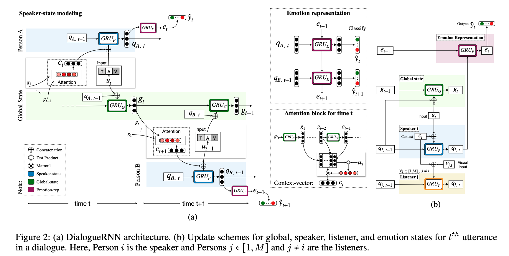
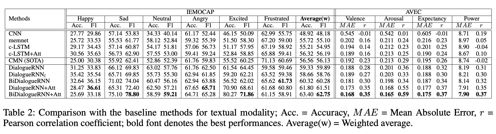
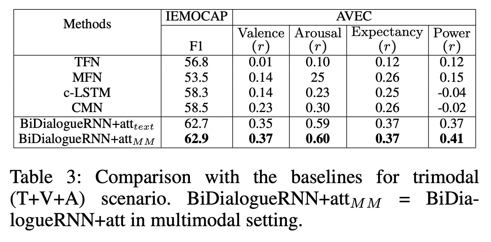
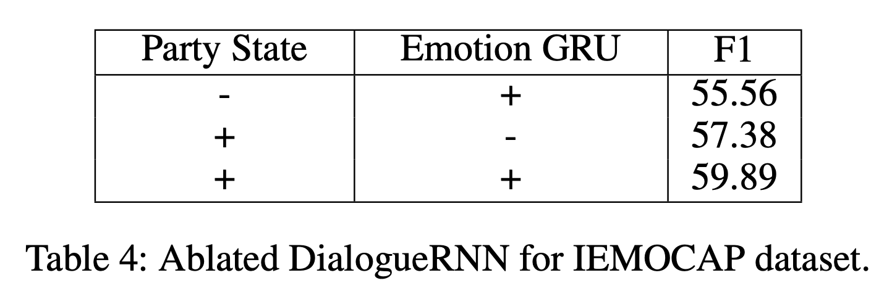

# DialogueRNN: An Attentive RNN for Emotion Detection in Conversations

【Authors】Navonil Majumder, Soujanya Poria, Devamanyu Hazarika, Rada Mihalcea, Alexander Gelbukh, Erik Cambria  
【Publisher】AAAI 2019   
【Submission】2019  
【URL】[https://arxiv.org/abs/1811.00405](https://arxiv.org/abs/1811.00405)  

【Abstract】  
Emotion detection in conversations is a necessary step for a number of applications, including opinion mining over chat history, social media threads, debates, argumentation mining, understanding consumer feedback in live conversations, etc. Currently, systems do not treat the parties in the conversation individually by adapting to the speaker of each utterance. In this paper, we describe a new method based on recurrent neural networks that keeps track of the individual party states throughout the conversation and uses this information for emotion classification. Our model outperforms the state of the art by a significant margin on two different datasets.  

## １．研究概要  
対話中における各話者の発話時の感情状態を推定するための，RNNベースのモデルを提案した．対話全体のコンテキストとその時々の発話を用いて，各話者の感情状態を更新していく方法が採用されている．dialogueGCNが登場する前は，いくつかの発話感情推定データセットでSOTAを保持していた．  
## ２．問題設定と解決した点  
従来の対話状況における感情推定モデルは，発話の時系列情報の活用に注力しており，話者情報(誰の発話か)を使用していなかった．これは，我々の対話理解と乖離しており，対話理解のための機械学習モデルの進歩の足枷となっている．DialogueRNNは，対話全体のコンテキストと自身の発話を用いて，ユーザーの感情状態を更新する"Speaker GRU"というコンポーネントを採用することで，この課題を解決した．
## ３．技術や手法のキモ  
  

DialogueRNNは3つのコンポーネント(Global GRU, Party GRU, Emotion GRU)から構成される．Global GRUは，対話全体のコンテキスト(Global State)を，Party GRUは，対話における各話者の状態(Party State)を，Emotion GRUは，発話者の感情状態をそれぞれ追跡する．  

### Global GRU
$$g_{t}=G R U_{\mathcal{G}}\left(g_{t-1},\left(u_{t} \oplus q_{s\left(u_{t}\right), t-1}\right)\right)$$  

$$
\begin{aligned}
\alpha &=\operatorname{softmax}\left(u_{t}^{T} W_{\alpha}\left[g_{1}, g_{2}, \ldots, g_{t-1}\right]\right) \\
\operatorname{softmax}(x) &=\left[e^{x_{1}} / \Sigma_{i} e^{x_{i}}, e^{x_{2}} / \Sigma_{i} e^{x_{i}}, \ldots\right] \\
c_{t} &=\alpha\left[g_{1}, g_{2}, \ldots, g_{t-1}\right]^{T}
\end{aligned}
$$  

$$
q_{s}\left(u_{t}\right), t=G R U_{\mathcal{P}}\left(q_{s}\left(u_{t}\right), t-1,\left(u_{t} \oplus c_{t}\right)\right)
$$

$$
\forall i \neq s\left(u_{t}\right), q_{i, t}=q_{i, t-1}
$$

$$
\forall i \neq s\left(u_{t}\right), q_{i, t}=G R U_{\mathcal{L}}\left(q_{i, t-1},\left(v_{i, t} \oplus c_{t}\right)\right)
$$

$$
e_{t}=G R U_{\mathcal{E}}\left(e_{t-1}, q_{s}\left(u_{t}\right), t\right)
$$  

$$
\begin{aligned}
l_{t} &=\operatorname{ReLU}\left(W_{l} e_{t}+b_{l}\right) \\
\mathcal{P}_{t} &=\operatorname{softmax}\left(W_{s \max } l_{t}+b_{s \max }\right) \\
\hat{y_{t}} &=\underset{i}{\operatorname{argmax}}\left(\mathcal{P}_{t}[i]\right)
\end{aligned}
$$
## ４．主張の有効性検証  

## ５．議論すべき点
## ６．次に読むべき論文
