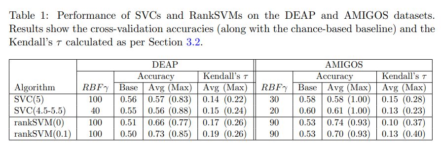

# A Study on Affect Model Validity: Nominal vs Ordinal Labels  

【Authors】David Melhart, Konstantinos Sfikas, Giorgos Giannakakis, Georgios Yannakakis Antonios Liapis  
【Publisher】IJCAI 2018 2nd Workshop on Artificial Intelligence in Affective Computing  
【Submission】2018    
【URL】http://proceedings.mlr.press/v86/melhart20a.html  

【Abstract】  
The question of representing emotion computationally remains largely unanswered: popular approaches require annotators to assign a magnitude (or a class) of some emotional dimension, while an alternative is to focus on the relationship between two or more options. Recent evidence in affective computing suggests that following a methodology of ordinal annotations and processing leads to better reliability and validity of the model. This paper compares the generality of classification methods versus preference learning methods in predicting the levels of arousal in two widely used affective datasets. Findings of this initial study further validate the hypothesis that approaching affect labels as ordinal data and building models via preference learning yields models of better validity.

## １．研究概要
分類モデル(SVC)とランキングモデル(Rank-SVM)を感情モデリングにおける有効性の観点から比較した．
## ２．問題設定と解決した点
感情モデリングは，クラス分類問題や回帰問題として扱われることが多い．しかし，感情は絶対値というよりむしろ相対的なものであることを示す証拠は豊富にある．  
本研究では，分類モデルとランキングモデルを比較することをとして，感情モデリングをランキング問題として扱うことの有効性を示した．
## ３．技術や手法のキモ
SVMおよびRank-SVMにおいて，予測変数の決定境界からの相対距離を信頼度とみなすことでグローバルランクを作成し，ケンドールの順位相関係数を用いて比較した．
## ４．主張の有効性検証  
SVMの精度はクラス分類で，Rank-SVMの精度はペアワイズ比較であることに注意．  

## ５．議論すべき点
テストデータでパラメータチューニングしている．
