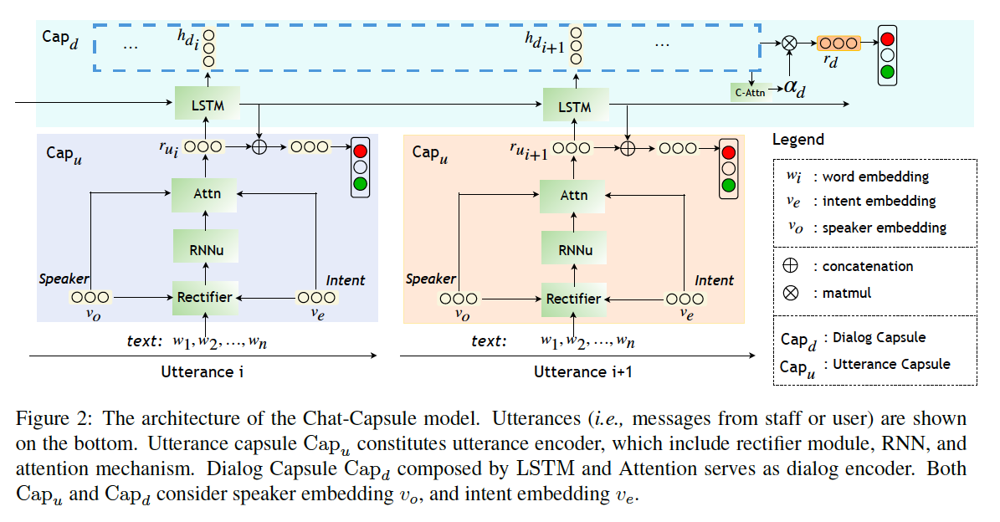

# Chat-Capsule: A Hierarchical Capsule for Dialog-level Emotion Analysis

【Authors】Yequan Wang, Xuying Meng, Yiyi Liu, Aixin Sun, Yao Wang, Yinhe Zheng, Minlie Huang
【Publisher】preprint  
【Submission】2022   
【URL】[[https://ieeexplore.ieee.org/document/7439777](https://ieeexplore.ieee.org/document/7903629)  ](https://arxiv.org/abs/2203.12254)

【Abstract】  
Many studies on dialog emotion analysis focus on utterance-level emotion only. These models hence are not optimized for dialog-level emotion detection, i.e. to predict the emotion category of a dialog as a whole. More importantly, these models cannot benefit from the context provided by the whole dialog. In real-world applications, annotations to dialog could fine-grained, including both utterance-level tags (e.g. speaker type, intent category, and emotion category), and dialog-level tags (e.g. user satisfaction, and emotion curve category). In this paper, we propose a Context-based Hierarchical Attention Capsule~(Chat-Capsule) model, which models both utterance-level and dialog-level emotions and their interrelations. On a dialog dataset collected from customer support of an e-commerce platform, our model is also able to predict user satisfaction and emotion curve category. Emotion curve refers to the change of emotions along the development of a conversation. Experiments show that the proposed Chat-Capsule outperform state-of-the-art baselines on both benchmark dataset and proprietary dataset. Source code will be released upon acceptance.

## １．研究概要  
対話レベルの感情推定のための，階層カプセル構造のモデルを提案した．
## ２．問題設定と解決した点  
対話レベルの感情推定はほとんど進んでいないため，筆者らは，対話レベルのアノテーションが付与されたuser-staff間の対話データセットを作成し，対話レベルの感情推定モデルを提案した
## ３．技術や手法のキモ  

## ４．主張の有効性検証
## ５．議論すべき点
## ６．次に読むべき論文
