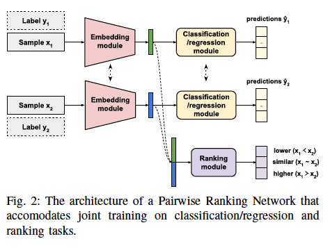
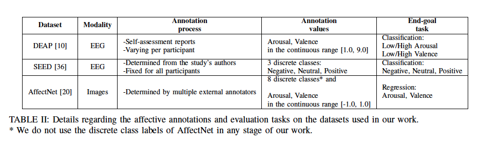
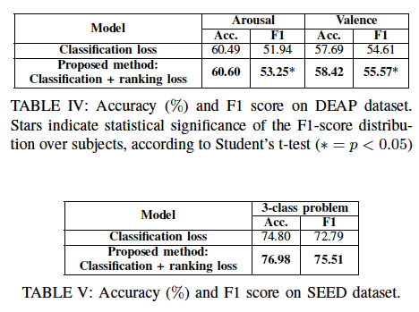
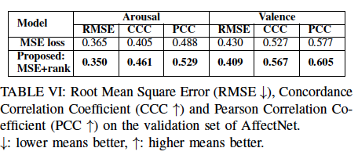

# Pairwise Ranking Network for Affect Recognition

【Authors】Georgios Zoumpourlis, Ioannis Patras  
【CPublisher】ACII 2021  
【Submission】2021  
【URL】https://ieeexplore.ieee.org/abstract/document/9597392  

【Abstract】  
In this work we study the problem of emotion recognition under the prism of preference learning. Affective datasets are typically annotated by assigning a single absolute label, i.e. a numerical value that describes the intensity of an emotional attribute, to each sample. Then, the majority of existing works on affect recognition employ sample-wise classification/regression methods to predict affective states, using those annotations. We take a different approach and use a deep network architecture that performs joint training on the tasks of classification/regression of samples and ordinal ranking between pairs of samples. By treating input samples in a pairwise manner, we leverage the auxiliary task of inferring the ordinal relation between their corresponding affective states. Incorporating the ranking objective allows capturing the inherently ordinal structure of emotions and learning the inter-sample relations, resulting in better generalization. Our method is incorporated into existing affect recognition architectures and evaluated on datasets of electroencephalograms (EEG) and images. We show that the approach proposed in this work leads to consistent performance gains when incorporated in classification/regression networks. Index Terms—Affect annotation, emotion recognition, electroencephalogram, facial expressions.  

## １．研究概要  
感情認識で一般的なsample-wiseの回帰/分類タスクに，pair-wiseランキングをサブタスクとして追加することで，元々のタスクの性能も向上することを検証した．

We verified that adding pair-wise ranking as a subtask to a sample-wise regression/classification task, which is common in emotion recognition, also improves the performance of the original task.

## ２．問題設定と解決した点  
従来の自己報告の感情認識は，回帰/分類タスクとしてモデルを学習してきたが，それには次のような問題点がある．  
まず，自身の感情状態を連続的な値に変換することは，個人の尺度バイアスの影響を受けやすく，機械学習モデルの学習に有害であることが知られている．  
そこで，連続的な値を高群/低群のような低次元の分類に変換する方法が考えられるが，この方法では，同じクラス間あるいは異なるクラス間における序数的な情報を失ってしまう可能性がある．  
さらに，高群/低群の基準値は，人間が恣意的に決めるため，感情の本質を反映できないかもしれない．
本研究では，回帰/分類タスクの機械学習モデルに対して，pair-wiseランキングのサブタスクを課して，序数的な情報を利用することで，元々のタスクの性能を向上させた．  
Conventional self-report emotion recognition has trained models as a regression/classification task, which has the following problems.  First, it is known that converting one's emotional state into continuous values is susceptible to individual scaling bias, which is detrimental to the training of machine learning models.  However, this method may lose ordinal information between the same or different classes.  Furthermore, the criterion value of high/low group is arbitrarily determined by humans and may not reflect the true nature of the emotion. In this study, we imposed a pair-wise ranking subtask on a machine learning model of a regression/classification task to improve the performance of the original task by utilizing ordinal information. 

## ３．技術や手法のキモ

マルチタスクとして，元々のタスクにpair-wiseランキングのサブタスクを追加する．
pair-wiseランキングのために新たにデータを取得する必要性がなく，既存のデータセットにサブタスクを追加するだけで，性能を向上できる点がキモ．
Add a pair-wise ranking subtask to the original task as a multitask.
The key point is that there is no need to acquire new data for pair-wise ranking, and performance can be improved simply by adding a subtask to the existing dataset.

## ４．主張の有効性検証

DEAP[脳波，自己アノテーション，分類], SEED[脳波，一人のアノテーター，分類]，AffectNet[画像, 複数の外部アノテーター, 回帰]の３種類のデータセットを用いて検証した．
Three datasets were validated: DEAP [EEG, self-annotation, classification], SEED [EEG, single annotator, classification], and AffectNet [images, multiple external annotators, regression].

SEEDの結果が最も解釈しやすい．すなわち，同一のアノテーターは同じ基準でアノテーションしているため，その順序関係の情報を利用することで，元々の分類タスクの性能も向上したと考えられる．  
DEAPとAffectNetは，個人の尺度バイアスが含まれるはずだが，それでもpair-wiseランキングのサブタスクが元々の性能を向上させたことが報告されている．  
The SEED results are the easiest to interpret. That is, since the same annotators annotated the same criteria, it is likely that the performance of the original classification task was also improved by using the information about their ordinal relationships.  
Although DEAP and AffectNet should include individual scaling biases, they still report that the pair-wise ranking subtask improved the original performance.

## ５．議論すべき点
自己報告感情の個人の尺度バイアスを直接的に解決したわけではない．
