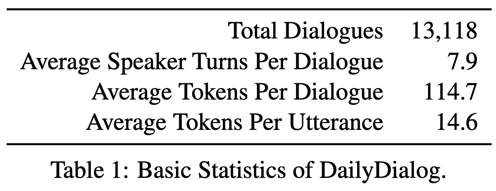
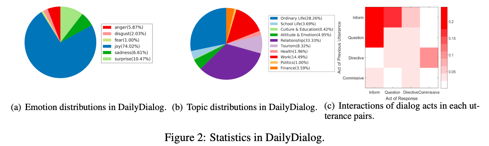

# DailyDialog: A Manually Labelled Multi-turn Dialogue Dataset

【Authors】Yanran Li, Hui Su, Xiaoyu Shen, Wenjie Li, Ziqiang Cao, Shuzi Niu
【CPublisher】IJCNLP 2017  
【Submission】2017  
【URL】[https://ieeexplore.ieee.org/abstract/document/9597392  ](https://aclanthology.org/I17-1099/)

【Abstract】  
We develop a high-quality multi-turn dialog dataset, DailyDialog, which is intriguing in several aspects. The language is human-written and less noisy. The dialogues in the dataset reflect our daily communication way and cover various topics about our daily life. We also manually label the developed dataset with communication intention and emotion information. Then, we evaluate existing approaches on DailyDialog dataset and hope it benefit the research field of dialog systems. The dataset is available on http://yanran.li/dailydialog  

## １．研究概要  
日常対話のそれぞれの発話にダイアログアクトと感情ラベルを付与したデータセットを公開した．  

  

  
