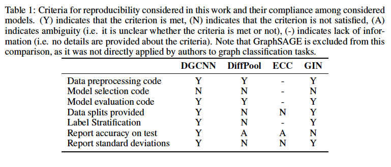
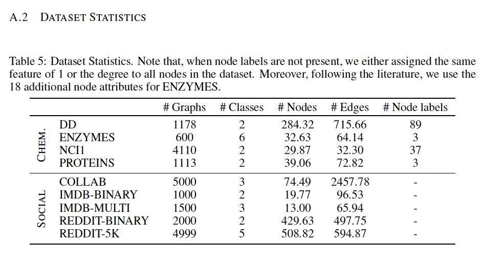
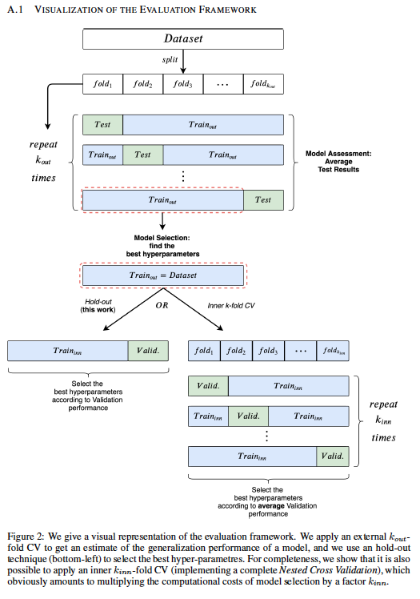
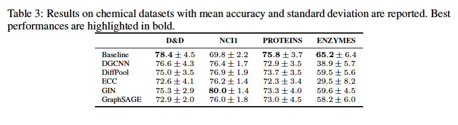
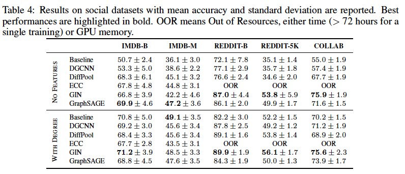
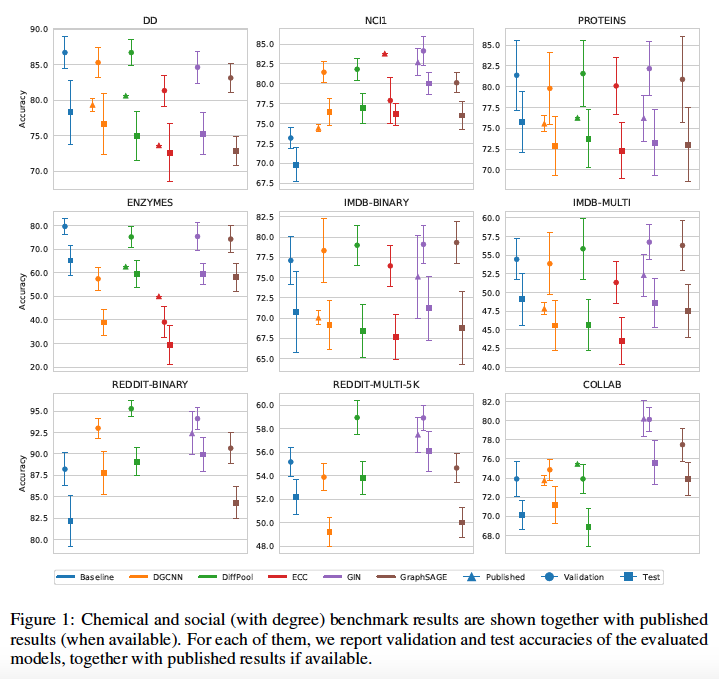

# A Fair Comparison of Graph Neural Networks for Graph Classification

【Authors】Federico Errica, Marco Podda, Davide Bacciu, Alessio Micheli  
【Publisher】ICLR 2020  
【Submission】2020  
【URL】https://openreview.net/forum?id=HygDF6NFPB  

【Abstract】  
Experimental reproducibility and replicability are critical topics in machine learning. Authors have often raised concerns about their lack in scientific publications to improve the quality of the field. Recently, the graph representation learning field has attracted the attention of a wide research community, which resulted in a large stream of works.
As such, several Graph Neural Network models have been developed to effectively tackle graph classification. However, experimental procedures often lack rigorousness and are hardly reproducible. Motivated by this, we provide an overview of common practices that should be avoided to fairly compare with the state of the art. To counter this troubling trend, we ran more than 47000 experiments in a controlled and uniform framework to re-evaluate five popular models across nine common benchmarks. Moreover, by comparing GNNs with structure-agnostic baselines we provide convincing evidence that, on some datasets, structural information has not been exploited yet. We believe that this work can contribute to the development of the graph learning field, by providing a much needed grounding for rigorous evaluations of graph classification models.  

## １．研究概要  
グラフ分類のためのグラフニューラルネットワーク(GNN)の実験再現性及び複製可能性に関する検証を行った．また，構造情報を用いないベースラインと比較することで，既存のGNNがタスクを解く際に，構造情報をほとんど利用できていないことを示した．
## ２．問題設定と解決した点  
GNNは様々な分野で一般的に使用される方法になったにも関わらず，実験手順は厳密性に欠け，再現性に乏しいことがしばしばある．この研究では，この現状を踏まえて，再現性のある実験をするために避けるべき手法を紹介する．また，統一的なフレームワークを用いた実験により，9つのデータセットで，5つの有名なモデルの公平な再評価を行った．
## ３．技術や手法のキモ  

  

GNNの有名な5つの論文を精査して，再現実験に必要な項目を満たしているか確認した．その結果，ほとんどのモデルで実験設定が不十分であることが示された．

  

  

各モデルを公平に比較するために統一的なフレームワークを用いて，9つのデータセットで検証を行った．

## ４．主張の有効性検証  

  

  

  

実験の結果，化学系のタスクでは，GNNが構造情報をほとんど活用できていないことが分かった．さらに，ほとんどのモデルで，論文と同等の精度を再現できないことが示された．
