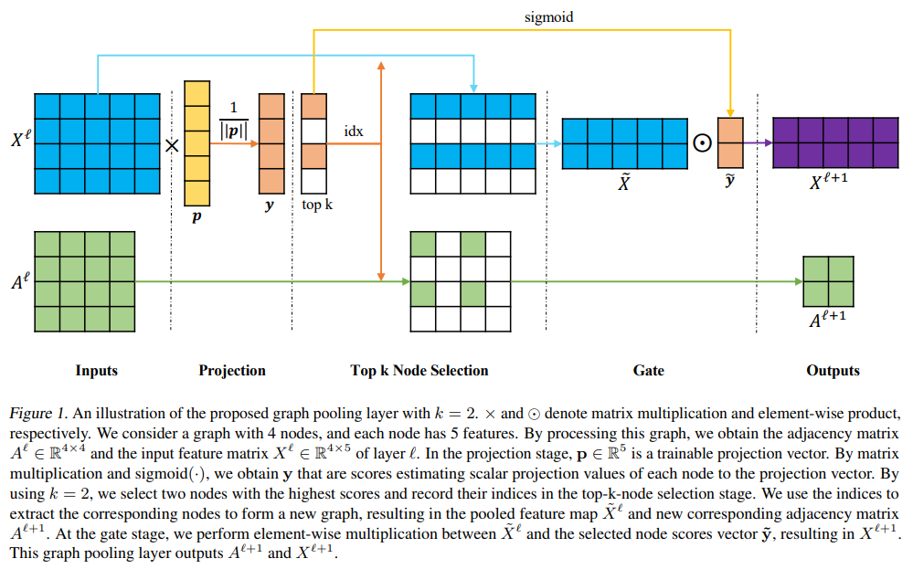
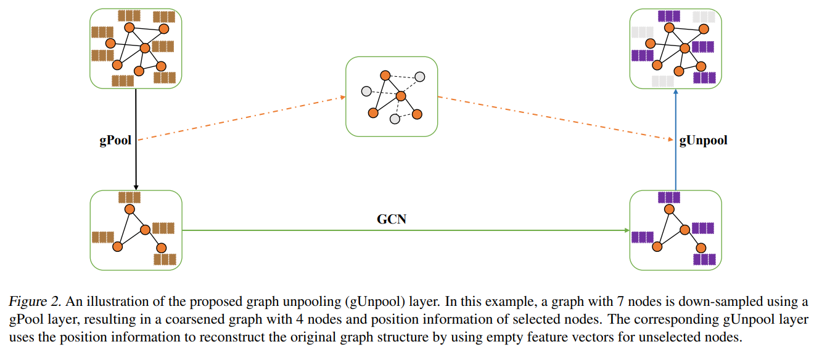
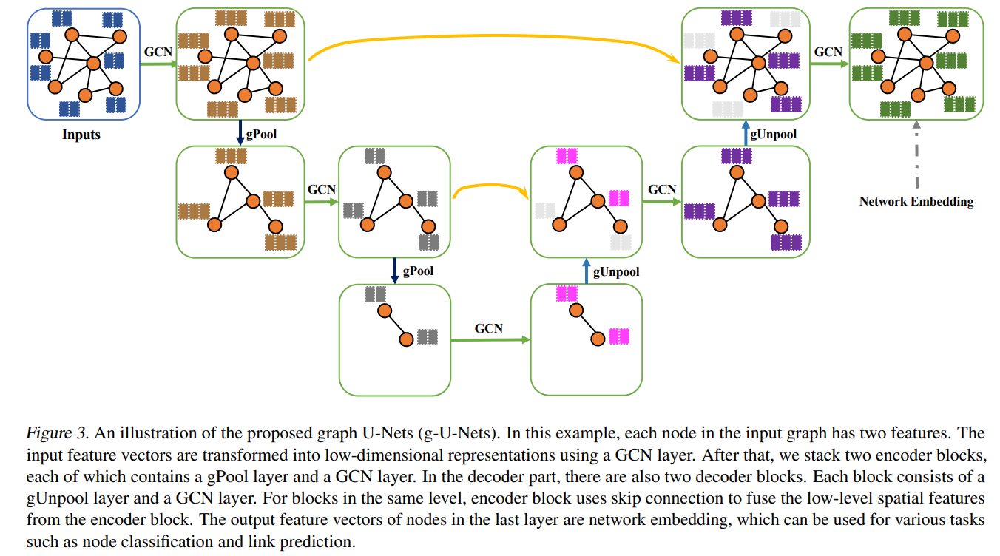
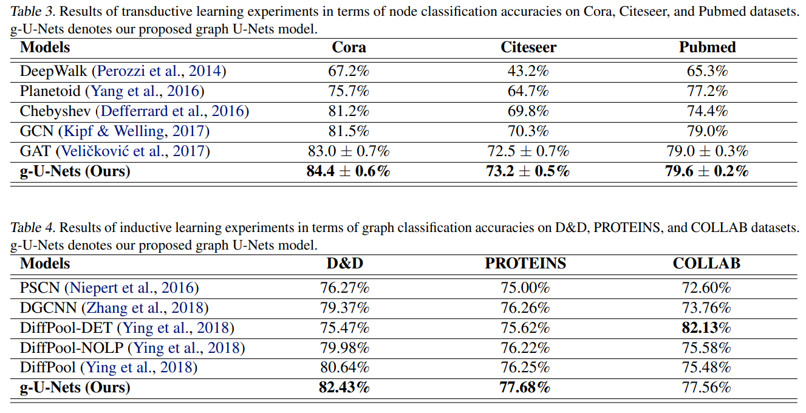
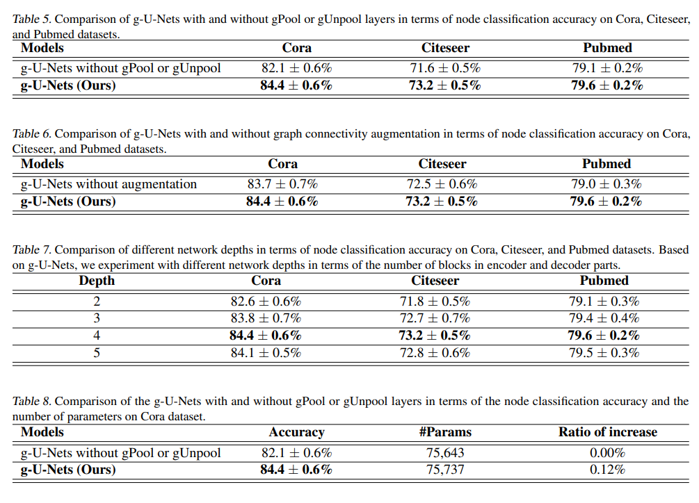

# Graph U-Nets

【Authors】Hongyang Gao, Shuiwang Ji  
【Publisher】ICML2019  
【Submission】2019  
【URL】https://arxiv.org/abs/1905.05178  

【Abstract】  
We consider the problem of representation learning for graph data. Convolutional neural networks can naturally operate on images, but have significant challenges in dealing with graph data. Given images are special cases of graphs with nodes lie on 2D lattices, graph embedding tasks have a natural correspondence with image pixel-wise prediction tasks such as segmentation. While encoder-decoder architectures like U-Nets have been successfully applied on many image pixel-wise prediction tasks, similar methods are lacking for graph data. This is due to the fact that pooling and up-sampling operations are not natural on graph data. To address these challenges, we propose novel graph pooling (gPool) and unpooling (gUnpool) operations in this work. The gPool layer adaptively selects some nodes to form a smaller graph based on their scalar projection values on a trainable projection vector. We further propose the gUnpool layer as the inverse operation of the gPool layer. The gUnpool layer restores the graph into its original structure using the position information of nodes selected in the corresponding gPool layer. Based on our proposed gPool and gUnpool layers, we develop an encoder-decoder model on graph, known as the graph U-Nets. Our experimental results on node classification and graph classification tasks demonstrate that our methods achieve consistently better performance than previous models.  

## １．研究概要  
各ノードの重要スコアを計算し，重要スコアに応じてノードを選択してからグラフをプーリング（小さいグラフに変換）する手法を提案した．U-Netと呼ばれる画像認識分野の有名な手法をグラフに適応する研究としても解釈できる．
## ２．問題設定と解決した点  
グラフは，画像のように規則的な格子ではないためプーリング処理が困難である．そこで，この研究ではGNNにおけるプーリング手法であるgPoolを提案する．
gPoolは，重要ノードの関係性に注意を向ける．
## ３．技術や手法のキモ  

  

gPoolは，各ノードの特徴量（上図の青色）を入力として，重要スコア（上図の肌色）を出力する関数（上図の黄色）を，グラフとは別に学習する．そして，重要スコアの上位k個を抽出し，重要度に応じた重みづけをしたものを抽出する．  

  

次にgUnpoolについて整理する．gUnpoolは，gPoolによってダウンサンプリングされたグラフに畳み込み処理を施したグラフを元のグラフサイズに復元する．この時，gPoolで選ばれなかったノードの部分には空の行列を挿入する．  

  

本研究では，このgPoolとgUnpoolによって，高レベルな特徴を捕捉できるらしい（？）
## ４．主張の有効性検証  
  
ノード分類タスクとグラフ分類タスクにおいて，提案手法が従来手法の精度を上回ることが示された．  

  

さらにアブレーションスタディによって，gPoolとgUnpoolが精度向上に貢献していること（Table5）とgPoolとgUnpoolの深さの精度に対する貢（Table7）が明らかになった．  

## ５．議論すべき点  
グラフにおいてなぜU-Netが有効だったのかに関する考察が少なかった．
