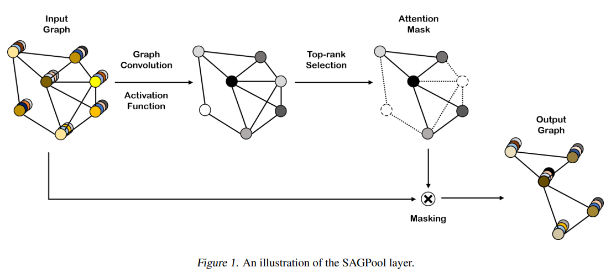
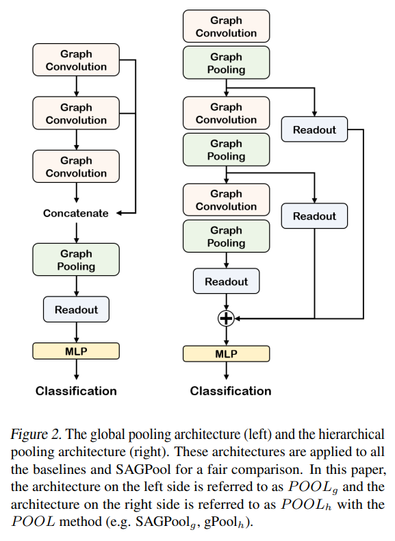
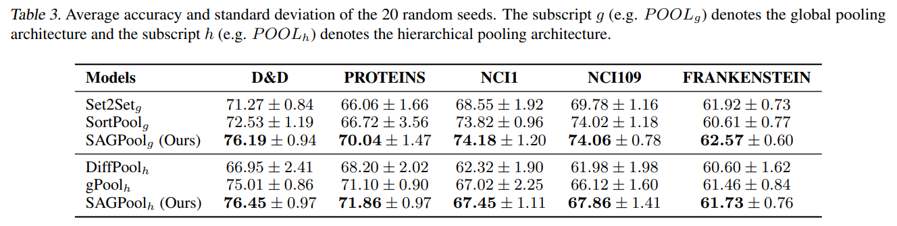
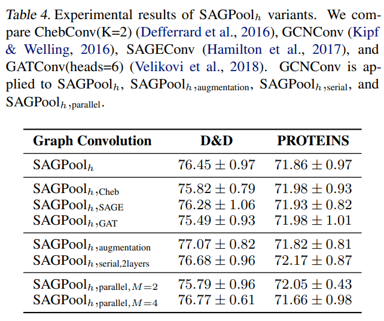
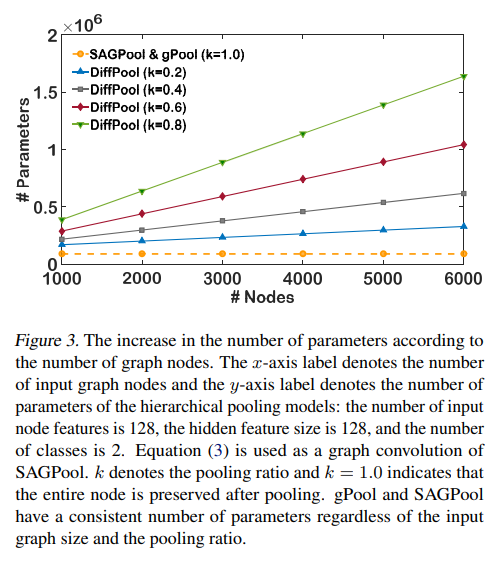

# Self-Attention Graph Pooling  

【Authors】Junhyun Lee, Inyeop Lee, Jaewoo Kang  
【Publisher】ICML  
【Submission】2019  
【URL】https://proceedings.mlr.press/v97/lee19c.html  

【Abstract】  
Advanced methods of applying deep learning to structured data such as graphs have been proposed in recent years. In particular, studies have focused on generalizing convolutional neural networks to graph data, which includes redefining the convolution and the downsampling (pooling) operations for graphs. The method of generalizing the convolution operation to graphs has been proven to improve performance and is widely used. However, the method of applying downsampling to graphs is still difficult to perform and has room for improvement. In this paper, we propose a graph pooling method based on self-attention. Self-attention using graph convolution allows our pooling method to consider both node features and graph topology. To ensure a fair comparison, the same training procedures and model architectures were used for the existing pooling methods and our method. The experimental results demonstrate that our method achieves superior graph classification performance on the benchmark datasets using a reasonable number of parameters.

## １．研究概要  
自己アテンションに基づくグラフプーリング法を提案する．グラフの畳み込みを用いた自己アテンションにより、本プーリング法はノードの特徴とグラフのトポロジーの両方を考慮することができる．
## ２．問題設定と解決した点  
従来のダウンサンプリング手法は，パラメータ数がノード数に依存するため計算量が多い．また，グラフのトポロジカル情報の一部を犠牲にしている．
そこで本研究では、比較的少ないパラメータでエンドツーエンドに階層的表現を学習することができる手法を提案する。自己アテンション機構を利用して、削除すべきノードと保持すべきノードを区別する。
グラフの畳み込みを利用して注意スコアを計算する自己アテンション機構により、ノードの特徴やグラフのトポロジーが考慮される。つまり、提案手法は，従来の手法の長所を併せ持つ．
## ３．技術や手法のキモ  

  
本研究のキモであるSAGPoolは，畳み込み処理の後に各ノードの重要度を計算し，上位k個のノードのみを残すことでダウンサンプリングを行うプーリング法である．  

  
このSAGPoolをどこで行うかに関して，Global Pooling ArchitectureとHierarchical Pooling Architectureの２種類を提案している． 
## ４．主張の有効性検証  

  
化学分野におけるグラフ分類データセットで提案手法を評価した．２種類のアーキテクチャーのどちらが優れているかは一概には言えないものの，SAGPoolの有効性が示唆された．  

  
畳み込みの計算方法，アテンションの計算方法，アテンションの計算回数の異なるモデルで比較も行った．  

  
またノードの選択が行われるために，パラメータ数が抑えられることを検証した．

