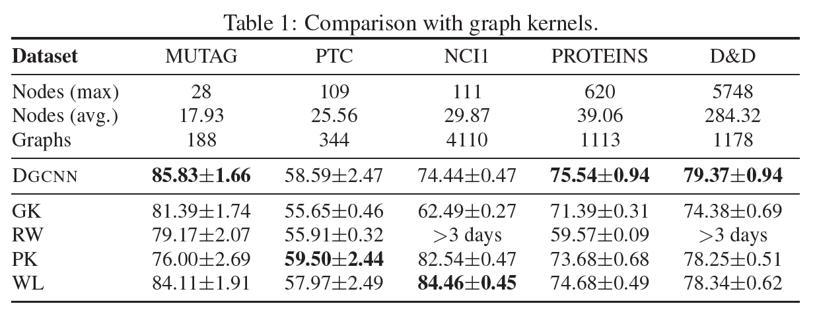

# An End-to-End Deep Learning Architecture for Graph Classification  

【Authors】Muhan Zhang Zhicheng Cui Marion Neumann Yixin Chen  
【Publisher】AAAI 2018  
【Submission】2018  
【URL】https://ojs.aaai.org/index.php/AAAI/article/view/11782  

【Abstract】  
Neural networks are typically designed to deal with data in tensor forms. In this paper, we propose a novel neural network architecture accepting graphs of arbitrary structure. Given a dataset containing graphs in the form of (G,y) where G is a graph and y is its class, we aim to develop neural networks that read the graphs directly and learn a classification function. There are two main challenges: 1) how to extract useful features characterizing the rich information encoded in a graph for classification purpose, and 2) how to sequentially read a graph in a meaningful and consistent order. To address the first challenge, we design a localized graph convolution model and show its connection with two graph kernels. To address the second challenge, we design a novel SortPooling layer which sorts graph vertices in a consistent order so that traditional neural networks can be trained on the graphs. Experiments on benchmark graph classification datasets demonstrate that the proposed architecture achieves highly competitive performance with state-of-the-art graph kernels and other graph neural network methods. Moreover, the architecture allows end-to-end gradient-based training with original graphs, without the need to first transform graphs into vectors.  

## １．研究概要  
グラフ畳み込みネットワークの先駆的研究．グラフ分類のためにノード特徴をSortPoolingという手法で集約している．  
## ２．問題設定と解決した点  
従来のGNNモデルは，グラフ分類の精度が比較的悪い．その理由は，局所的なノード特徴を抽出した後に，それらを合計してグラフ特徴を抽出しており，グラフの多くの情報が失われるためであると考えられる．そこで，SortPoolingという手法を提案した．SortPoolingはノード特徴を合計するのではなく，一貫した順序で並べ，一定の大きさでソートされたグラフ表現を出力する．
## ３．技術や手法のキモ  

  

ノードごとに各畳み込み層のノード特徴を並べる．そして，最後の畳み込み層のノード特徴をもとにしてノードの順番を降順に並び替える．  
そして，事前に決めておいたパラメータk個だけ，上位のノードを取り出して，後続のCNNに渡して分類する．  
## ４．主張の有効性検証  

  

  

従来のグラフカーネル手法およびGNNと比較して，提案手法の有効性を検証した．
