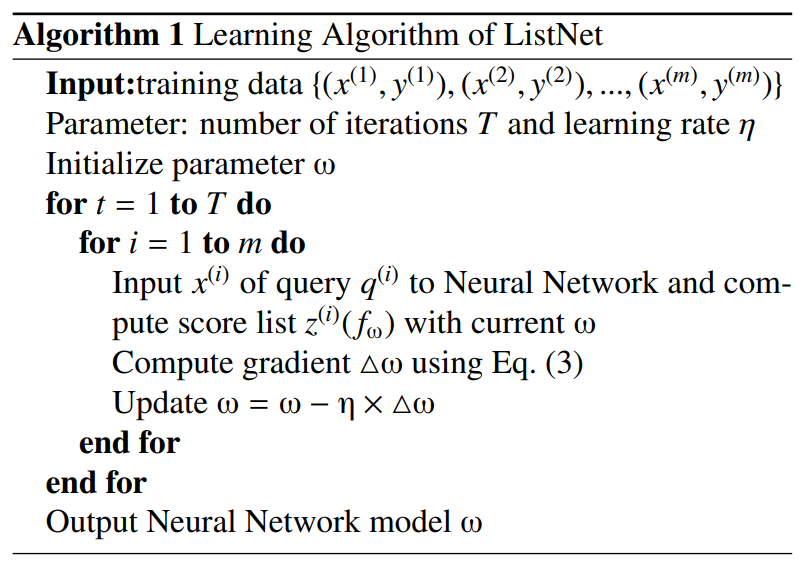

# Learning to Rank: From Pairwise Approach to Listwise Approach  

【Authors】Zhe Cao, Tao Qin, Tie-Yan Liu, Ming-Feng Tsai, Hang Li  
【Publisher】ICML2007  
【Submission】2007  
【URL】https://www.microsoft.com/en-us/research/wp-content/uploads/2016/02/tr-2007-40.pdf  

【Abstract】  
The paper is concerned with learning to rank, which is to construct a model or a function for ranking objects. Learning to rank is useful for document retrieval, collaborative filtering, and many other applications. Several methods for learning to rank have been proposed, which take object pairs as ‘instances’ in learning. We refer to them as the pairwise approach in this paper. Although the pairwise approach offers advantages, it ignores the fact that ranking is a prediction task on list of objects. The paper postulates that learning to rank should adopt the listwise approach in which lists of objects are used as ‘instances’ in learning. The paper proposes a new probabilistic method for the approach. Specifically it introduces two probability models, respectively referred to as permutation probability and top one probability, to define a listwise loss function for learning. Neural Network and Gradient Descent are then employed as model and algorithm in the learning method. Experimental results on information retrieval show that the proposed listwise approach performs better than the pairwise approach.  

## １．研究概要  
ランキング対象をすべて関数に渡して，損失を計算するlistwiseアプローチのランキングアルゴリズムを提案した．  
## ２．問題設定と解決した点  
クエリと関連度の高い順にドキュメントを並び替えるタスクを想定する．あるクエリのドキュメント数はnとする．
pairwiseは，クエリごとにドキュメントの全ペア比較をするので，計算量が$O(n^2)$必要．また，ドキュメントが多いクエリに過学習してしまうという問題があった．
そこで，本研究ではクエリと全ドキュメントのリストを関数に入力して，ランキングを求めるListwiseアプローチのニューラルネットランキングモデルListNetを提案した．
ListNetはクエリごとに一回，損失を計算するため，ドキュメントが多いクエリに過学習してしまうという問題がない．また，ListNetはグローバルランキングの計算には，$O(n!)$が必要であるが，上位のランキング(例えば一位だけ)知りたい場合には計算量を大幅に削減できる．  
## ３．技術や手法のキモ  
ランキングの尤もらしさを示す置換確率を定義する．置換確率は，スコア(関連度)順のランキングでもっとも高い確率が得られて，その逆順のランキングで最も低い確率が割り当てられる．
そして，真のスコアを使って計算された置換確率$P_{y^{(i)}}(j)$と関数$f_{\omega}$の出力である予測スコアを使って計算された置換確率$P_{z^{(i)}}(j)$から損失を定義する．  

$$
L(y^{(i)},z^{(i)}) = -\Sigma_{j=1}^{n} P_{y^{(i)}}(j) \log P_{z^{(i)}}(j)
$$

  

この損失関数を最小化する．
## ４．主張の有効性検証  
3つのデータセットで従来手法よりも良い精度が得られることを検証した．  

  

  

## ５．議論すべき点  
NDCGを直接最適化することができるっぽい．  
## ６．参考  
[ListNet (Listwise Learning to Rank)](https://medium.com/@purbon/listnet-48f56cb80bb2)
