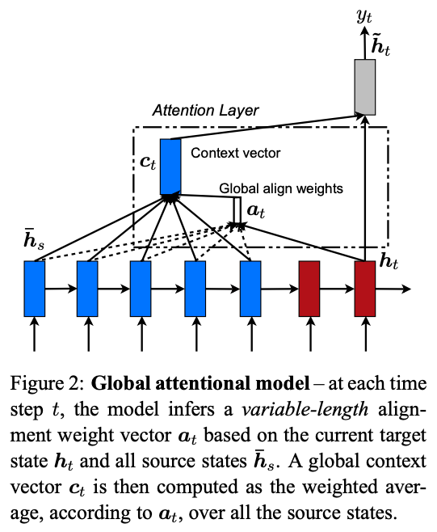
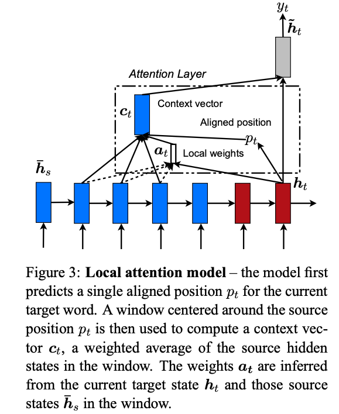
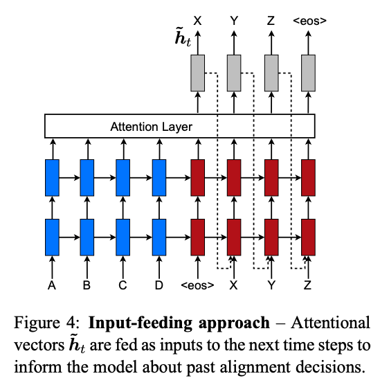
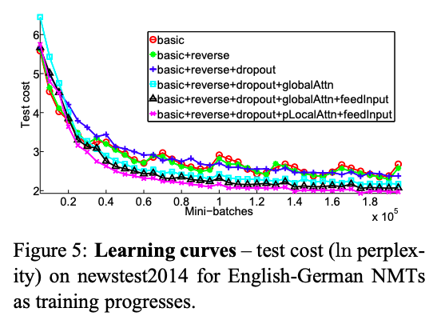
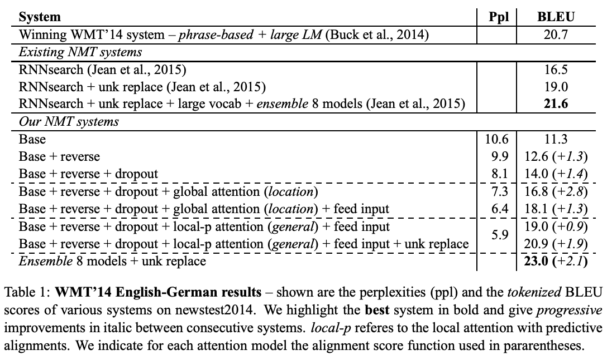
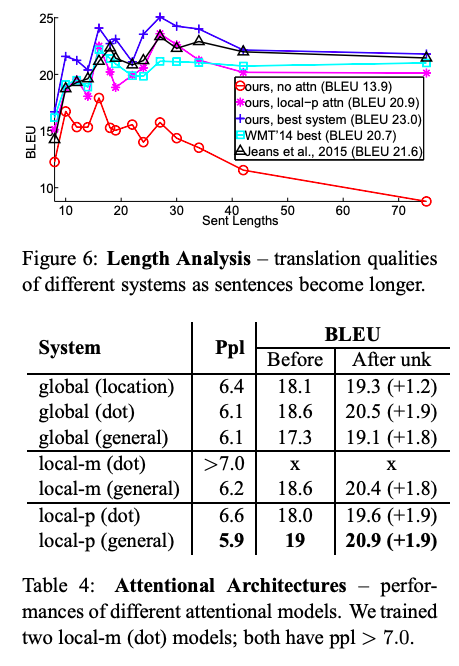

# Effective Approaches to Attention-based Neural Machine Translation

【Authors】Minh-Thang Luong, Hieu Pham, Christopher D. Manning
【Publisher】EMNLP 2015  
【Submission】2015  
【URL】https://arxiv.org/abs/1508.04025  

【Abstract】  
An attentional mechanism has lately been used to improve neural machine translation (NMT) by selectively focusing on parts of the source sentence during translation. However, there has been little work exploring useful architectures for attention-based NMT. This paper examines two simple and effective classes of attentional mechanism: a global approach which always attends to all source words and a local one that only looks at a subset of source words at a time. We demonstrate the effectiveness of both approaches over the WMT translation tasks between English and German in both directions. With local attention, we achieve a significant gain of 5.0 BLEU points over non-attentional systems which already incorporate known techniques such as dropout. Our ensemble model using different attention architectures has established a new state-of-the-art result in the WMT'15 English to German translation task with 25.9 BLEU points, an improvement of 1.0 BLEU points over the existing best system backed by NMT and an n-gram reranker.

## １．研究概要  
ニューラル機械翻訳において，何種類かのアテンションを提案し，比較した．Transformer以前の研究であることに注意．

## ２．問題設定と解決した点  
ニューラル機械翻訳において，どのようなアテンションが有効であるかを検証した研究はないため，この研究ではそれを明らかにした．
## ３．技術や手法のキモ  

アテンションをGlobal attentionとLocal attentionの2つに大別した．  

  

Global attentionは，sourceのすべての隠れ状態$\bar h_s$を用いて，targetの隠れ状態$h_t$におけるアテンションを計算する．
可変長のアテンションベクトルを$a_t$とすると，これは次の式で求められる．  

$$ 
a_t(s) = align(h_t, \bar h_s)
$$  

$$ 
 = \frac{exp(score(h_t, \bar h_s))}{\sum_{s^{\prime}}exp(score(h_t, \bar h_{s^{\prime}}))}
$$  

ここで，$score(h_t, \bar h_s)$の求め方には3種類ある．  

dot  

$$
h_t^\top \bar h_s
$$  

general  

$$
h_t^\top W_a \bar h_s
$$  

concat  

$$
v_a^\top tanh(W_a [h_t ; \bar h_s] )
$$  

また，これら以外にもtargetの隠れ状態だけを用いてアテンションを求める方法も考えられる．  

location  

$$
a_t = softmax(W_a h_t)
$$  

  

Loacal attentionでは，sourceの一部の隠れ状態だけを用いて，アテンションを求める．事前にsourceの一部の隠れ状態の位置$p_t$を決めておく方法をMonotonic alignmentと呼び，計算によって求める方法をPredictive alignmentと呼ぶ．  

  

さらに，過去のアテンション情報を使用できるようにしたものを Input-feeding Approachと呼ぶ．

## ４．主張の有効性検証  

  

  

  

さまざまなアテンション手法を持つRNNモデルと従来のモデル（アテンションなし）の比較を行った．これらの結果，アテンションが精度，学習速度，長文の翻訳などの点において有効であることが示された．
