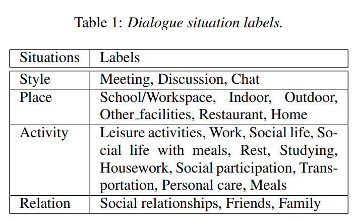
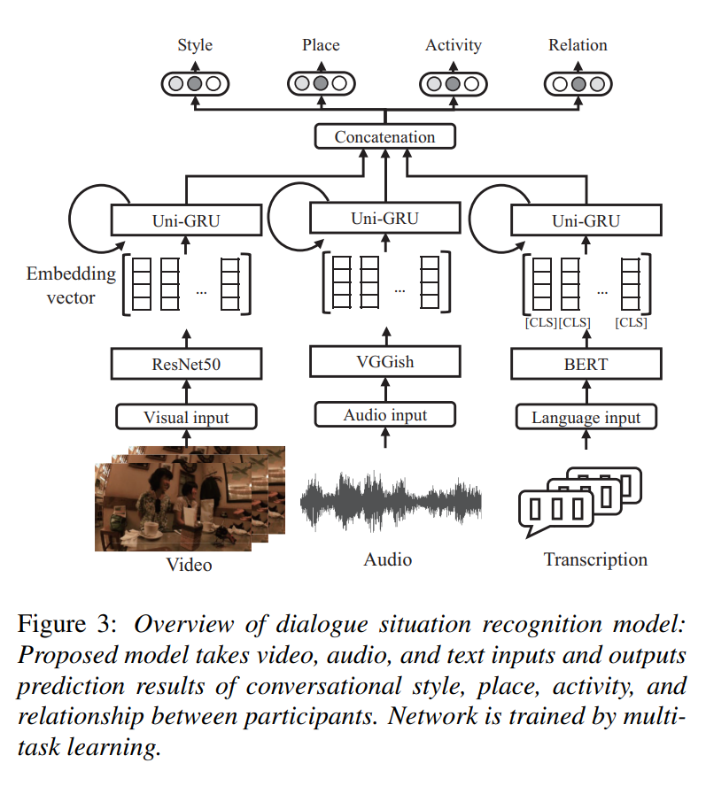
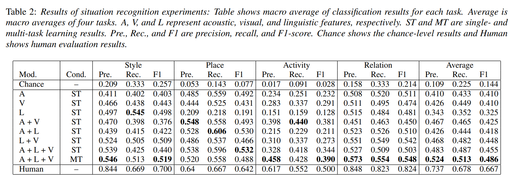

# Dialogue Situation Recognition for Everyday Conversation Using Multimodal Information  

【Authors】Yuya Chiba, Ryuichiro Higashinaka  
【Publisher】Interspeech2021  
【Submission】2021  
【URL】https://www.isca-speech.org/archive/interspeech_2021/chiba21_interspeech.html  

【Abstract】  
In recent years, dialogue systems have been applied to daily living. Such systems should be able to associate conversations with dialogue situations, such as a place where a dialogue occurs and the relationship between participants. In this study, we propose a dialogue situation recognition method that understands the perspective of dialogue scenes. The target dialogue situations contain dialogue styles, places, activities, and relations between participants. We used the Corpus of Everyday Japanese Conversation (CEJC), which records natural everyday conversations in various situations for experiments. We experimentally verified the effectiveness of our proposed method using multimodal information for situation recognition.  

## １．研究概要
視覚，音声，言語から対話の状況(Style, Place, Activity, Relation)を推定するタスクに取り組んだ．データセットには国語研の日本語日常対話コーパスを使用している．  

  

## ２．問題設定と解決した点
これまで研究されてこなかった対話状況の認識タスクに取り組んだ．
## ３．技術や手法のキモ
各モダリティの特徴量として，深層学習ベースの事前学習済みモデルから得られる埋め込み表現を使用している．また，対話の状況を認識する4つのタスク(Style, Place, Activity, Relation)をマルチタスクで学習した．  

  

## ４．主張の有効性検証  
チャンスレートと各モダリティの組み合わせのモデルを比較した．  

  

## ５．議論すべき点
外部アノテータが一人．GRUから系列特徴量を獲得する方法が不明瞭．交差検証していない．
