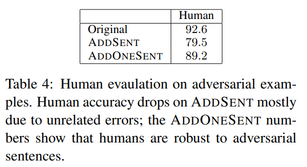
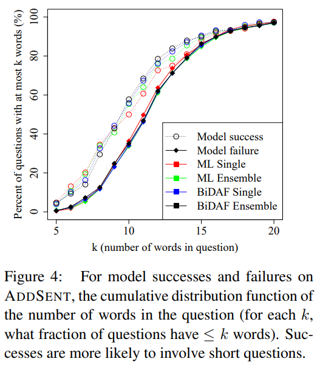

# Adversarial Examples for Evaluating Reading Comprehension Systems  

【Authors】Robin Jia, Percy Liang  
【Publisher】EMNLP 2017  
【Submission】2017  
【URL】https://arxiv.org/abs/1707.07328  

【Abstract】  
Standard accuracy metrics indicate that reading comprehension systems are making rapid progress, but the extent to which these systems truly understand language remains unclear. To reward systems with real language understanding abilities, we propose an adversarial evaluation scheme for the Stanford Question Answering Dataset (SQuAD). Our method tests whether systems can answer questions about paragraphs that contain adversarially inserted sentences, which are automatically generated to distract computer systems without changing the correct answer or misleading humans. In this adversarial setting, the accuracy of sixteen published models drops from an average of 75% F1 score to 36%; when the adversary is allowed to add ungrammatical sequences of words, average accuracy on four models decreases further to 7%. We hope our insights will motivate the development of new models that understand language more precisely.  

## １．研究概要  
SQuADデータセットに対して，敵対的な摂動を加える方法について提案している．また，敵対的な摂動を加えたSQuADデータセットを用いて，従来のモデルの頑健性を検証した．
## ２．問題設定と解決した点  
NLP分野で提案されてきた従来のモデルがどれほど自然言語を理解しているかについては不明である．また，一部ではモデルがタスクを効率って気に解くためのショートカットを利用しているという指摘もある．そこで，この研究では，敵対的摂動が加えられたデータセットを用いて，従来のモデルのロバスト性を検証した．
## ３．技術や手法のキモ  

  

2種類のAdversarial Exampleを提案した．基本的な方針はモデルが回答を間違えるような新しい文章を作成し，回答抽出のための文章にその一文を追加することである．
2つは作成方法と性質が異なる．ADDSENTは，質問文と回答をルールベースに書き換えることで，新しい文章を作成する．ADDANYは質問文と一般的な語句を使って，（文法ルールも無視して）単語の系列を作成する．これらは，モデルが誤った答えを出すように最適化される．また，ADDSENTとADDANYの簡易版として，ADDONESENTとADDONEANYも作成した．ADDONESENTは，質問文と回答を使用せず，回答と無関係な文章を追加する方法で，ADDONEANYは一般的な語句のみを使って，単語の系列を作成して文章に追加する．

## ４．主張の有効性検証  

  
  

従来手法を用いて通常時の精度とAdversarial Examplesに対する精度を比較した．その結果，ADDSENTとADDANYによって精度が大幅に下がることが分かった．
また，ADDONESENTとADDONEANYでも精度は大幅に下がった．一方で人間はAdversarial Examplesの影響をわずかしか受けなかった．

  
  

また，従来モデルが推定に成功するケースとそうでないケースにおけるデータの性質を調べた．すると，成功したケースでは，失敗したケースと比べて質問文と回答抽出用の文章でより多くのn-gramを共有していることが分かった（図3）．さらに，成功したケースでは，質問文が短い割合が失敗したケースよりも多いことが分かった（図4）．
最後に，あるモデルで最適化されたAdversarial Examplesが別のモデルの回答も誤らせることを検証した（表6）．
