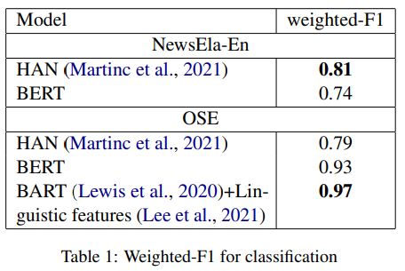
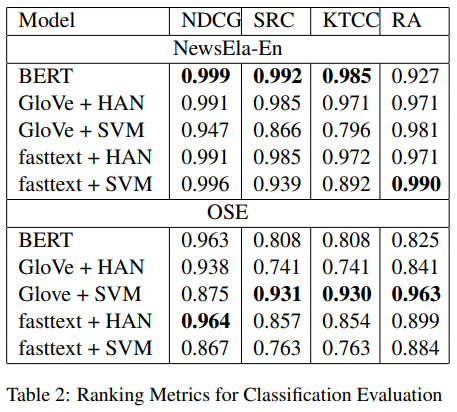
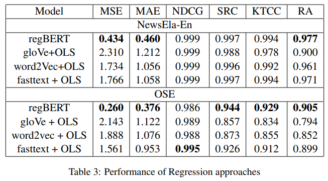
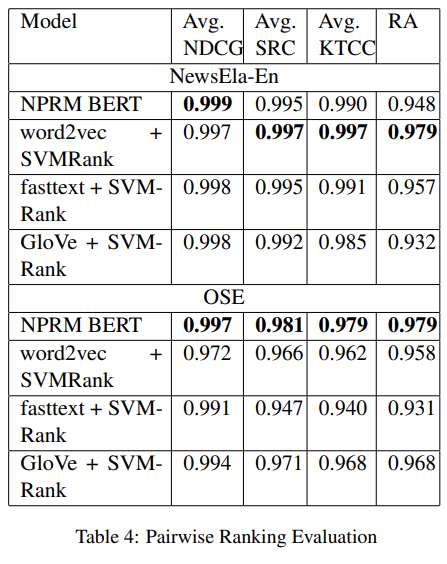
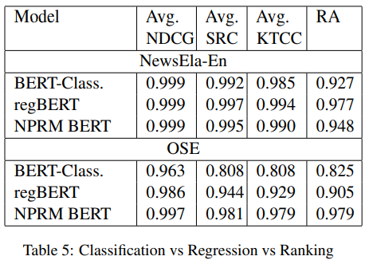
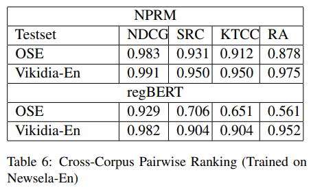
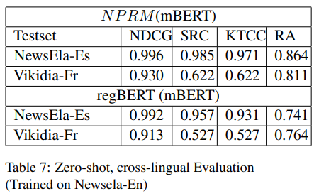

# A Neural Pairwise Ranking Model for Readability Assessment  

【Authors】Justin Lee, Sowmya Vajjala  
【Publisher】ACL2022  
【Submission】2022  
【URL】https://arxiv.org/abs/2203.07450  

【Abstract】  
Automatic Readability Assessment (ARA), the task of assigning a reading level to a text, is traditionally treated as a classification problem in NLP research. In this paper, we propose the first neural, pairwise ranking approach to ARA and compare it with existing classification, regression, and (non-neural) ranking methods. We establish the performance of our model by conducting experiments with three English, one French and one Spanish datasets. We demonstrate that our approach performs well in monolingual single/cross corpus testing scenarios and achieves a zero-shot cross-lingual ranking accuracy of over 80% for both French and Spanish when trained on English data. Additionally, we also release a new parallel bilingual readability dataset in English and French. To our knowledge, this paper proposes the first neural pairwise ranking model for ARA, and shows the first results of cross-lingual, zero-shot evaluation of ARA with neural models.  

## １．研究概要
自動的な文章の読解難易度評価(ARA)において，ペアワイズ手法を適用した．
## ２．問題設定と解決した点  
従来手法は，ARAをクラス分類や回帰タスクとして扱っていた．本研究では，ペアワイズ手法がARAにとってより良い手法であると仮定している．  
また共通の評価指標を用いてこれらのモデルを比較した．
## ３．技術や手法のキモ  
BERTをもとにしたペアワイズ手法を提案した．また評価に複数の指標を用いた．
## ４．主張の有効性検証  
クラス分類モデル，回帰モデル，ペアワイズモデルをそれぞれ評価した．加えてそれぞれの異なるタスクのモデルをランキング指標で評価した．  

・クラス分類モデル  

  

  

・回帰モデル  

  

・ペアワイズモデル  

  

・クラス分類モデルvs回帰モデルvsペアワイズモデル   

  

さらに本研究では，クロスコーパス設定で，ペアワイズモデルと回帰モデルを評価した．  

  

また，クロス言語のデータセットでのゼロショット設定で，ペアワイズモデルと回帰モデルを評価した． 

  
