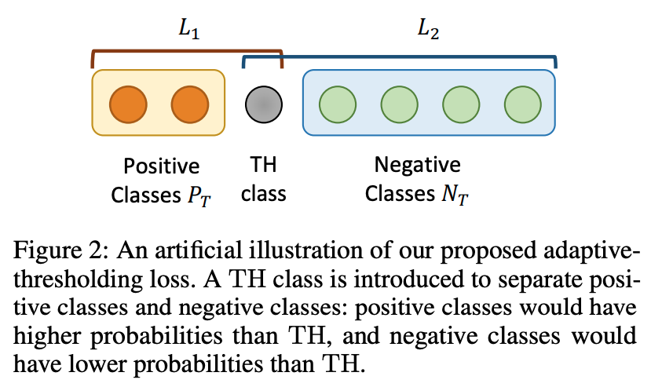

# Document-Level Relation Extraction with Adaptive Thresholding and Localized Context Pooling

【Authors】Wenxuan Zhou, Kevin Huang, Tengyu Ma, Jing Huang  
【Publisher】AAAI 2021  
【Submission】2020  
【URL】https://arxiv.org/abs/2010.11304  

【Abstract】  
Document-level relation extraction (RE) poses new challenges compared to its sentence-level counterpart. One document commonly contains multiple entity pairs, and one entity pair occurs multiple times in the document associated with multiple possible relations. In this paper, we propose two novel techniques, adaptive thresholding and localized context pooling, to solve the multi-label and multi-entity problems. The adaptive thresholding replaces the global threshold for multi-label classification in the prior work with a learnable entities-dependent threshold. The localized context pooling directly transfers attention from pre-trained language models to locate relevant context that is useful to decide the relation. We experiment on three document-level RE benchmark datasets: DocRED, a recently released large-scale RE dataset, and two datasets CDRand GDA in the biomedical domain. Our ATLOP (Adaptive Thresholding and Localized cOntext Pooling) model achieves an F1 score of 63.4, and also significantly outperforms existing models on both CDR and GDA.  

## １．研究概要  
エンティティ間の関係性を推定するマルチラベル問題において，適応的な閾値と局所的な文脈プーリングを組み合わせる手法を提案し，複数データセットのSOTAを更新した．  
## ２．問題設定と解決した点  
  
"関係性"や"エンティティペア"に応じて閾値が異なる場合に，従来的なグローバル（共通の単一な）閾値では対応できない．そこで，この研究ではthreshold(TH)クラスを追加した．THクラス対する確率値は，他のクラスと同様にエンティティごとに計算される．さらに，正解クラスに対する確率値がTHクラスに対する確率値よりも大きく，不正解クラスに対する確率値がTHクラスに対する確率値よりも小さくなる損失を使用することで，適応的な閾値を実現した．  

## ３．技術や手法のキモ  
適応的な閾値のために次のような損失関数を採用した．  

## ４．主張の有効性検証
## ５．議論すべき点
## ６．次に読むべき論文
